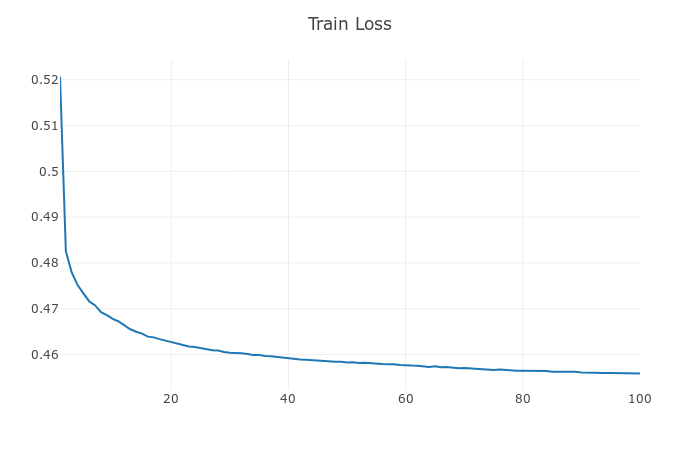
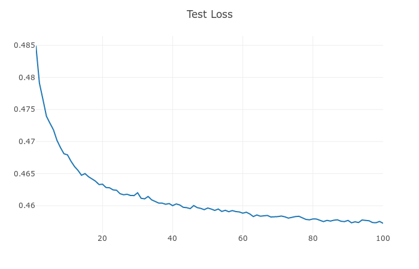
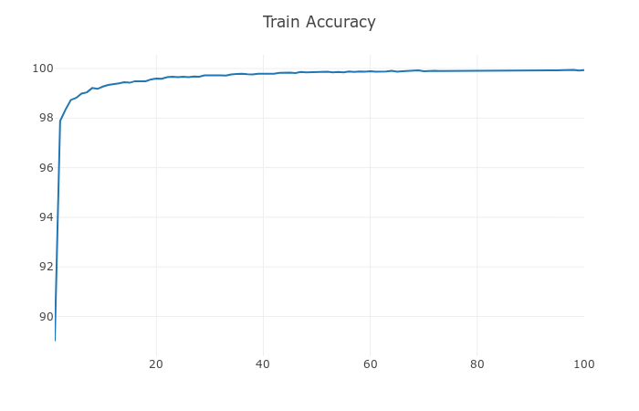
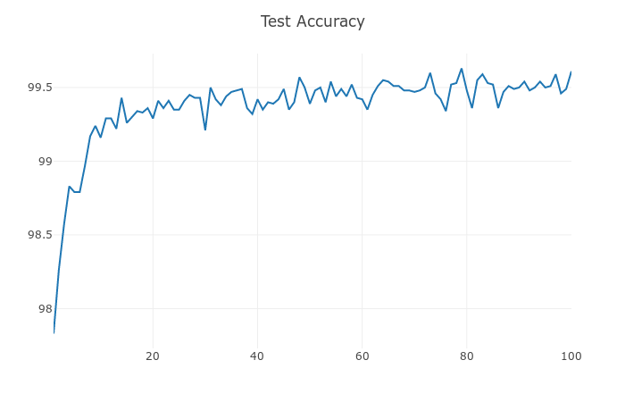
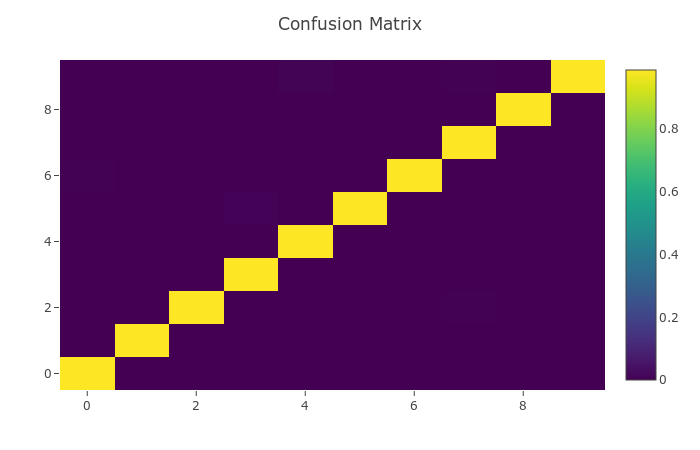

# CapsuleNetwork
pytorch, CapsNet
- [Capsule_Network_Jupyter](https://github.com/suhoy901/CapsuleNetwork/blob/master/CapsuleNetwork.ipynb)
 

A PyTorch implementation of CapsNet based on NIPS 2017 paper [Dynamic Routing Between Capsules](https://arxiv.org/abs/1710.09829).

<table>
  <tr>
    <td>
     
    </td>
    <td>
     
    </td>
  </tr>
</table>
<table>
  <tr>
    <td>
     
    </td>
    <td>
     
    </td>
  </tr>
</table>

정오분류표

<table>
  <tr>
    <td style="text-align: middle;">Ground Truth</td>
    <td style="text-align: middle;">Reconstruction</td>
  </tr>
  <tr>
    <td>
     
    </td>
    <td>
     
    </td>
  </tr>
</table>

## Credits
Primarily referenced this implementation:
- [PyTorch implementation by @Gram.AI](https://github.com/gram-ai/capsule-networks)
- [PyTorch implementation by @leftthomas](https://github.com/leftthomas/CapsNet)
